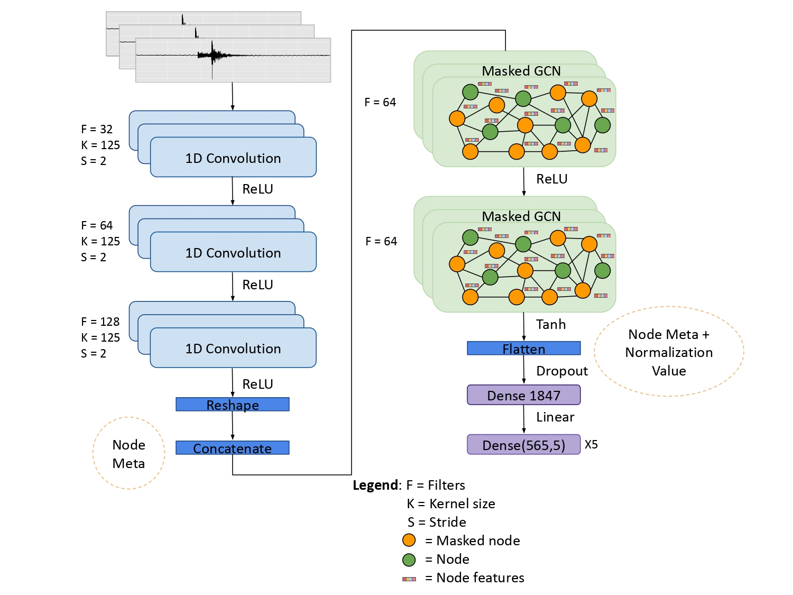

# Masked Graph Neural Network for Rapid Ground Motion Prediction in Italy

## Overview
This repository contains the implementation and dataset for the research paper "Masked graph neural network for the rapid ground motion prediction in Italy", focused on using graph neural networks (GNN) to predict ground motion intensities rapidly after an earthquak.

## Model Architecture



- **Input Layer**
Accepts raw data inputs, including seismic waveform data, arrival times, and distance matrices.

- **Convolutional Layers**
These layers process the seismic data to extract relevant features. We utilize 1D convolutions that are particularly effective for time-series data like waveforms.

- **Graph Convolutional Layers**
The core of the model where graph convolutions are applied. These layers use the topology of the seismic station network to propagate and learn features across the graph structured data.

- **Fully Connected Layers**
After graph convolutions, the features are passed through several fully connected layers to map the learned representations to the output predictions.

- **Output Layer**
Outputs the predicted seismic metrics such as Peak Ground Acceleration (PGA), Peak Ground Velocity (PGV), and different Spectral Accelerations (SA).

## Paper Summary
The paper presents an updated version of the TISER-GCN model, employing a masked graph convolutional network (Masked GCN) to predict seismic intensities based on 10-second seismic waveforms, without prior knowledge of earthquake specifics. The model was tested using the INSTANCE dataset, covering 600 seismic stations across Italy. The method shows promising results in predicting ground motions, maintaining error variance comparable to established models and reducing bias through the integration of additional data.

## Repository Content
- **Data:** [INSTANCE](https://www.pi.ingv.it/banche-dati/instance/) dataset used for training and testing the model.
- **Code:** Python scripts for training the Masked GCN model, evaluating its performance, and generating predictions.
- **Models:** Model configuration files.
- **Documentation:** Detailed explanation of the model architecture, training process, and evaluation metrics.

## How to Use
1. **Setup Environment**
   - Ensure Python 3.8+ is installed.
   - Install required libraries: `pip install -r requirements.txt`

2. **Download and Prepare Data**
   - Follow the instructions in the data section to download and preprocess the [INSTANCE](https://www.pi.ingv.it/banche-dati/instance/) dataset.

3. **Training the Model**
   - Run `python train_model.py` to train the model. Modify the script to tweak model parameters or training settings.

4. **Evaluate Model**
   - Use `evaluate_model.py` to assess the model's performance on a test set.

5. **Predicting Ground Motions**
   - Utilize `predict.py` with a set of seismic waveform data to generate predictions.

## Citing
If you find this research useful, please consider citing:
```
@article{masked_gcn_2025,
  title={Masked graph neural network for the rapid ground motion prediction in Italy},
  author={Trappolini, Danele et al.},
  journal={Non-peer reviewed Research Article submitted to SEISMICA},
  year={2025}
}
```

## Contributions and Support
- Contributions to this project are welcome. Please send pull requests or open issues for bugs or feature requests.
- For support, contact Daniele Trappolini at `daniele.trappolini@uniroma1.it`.